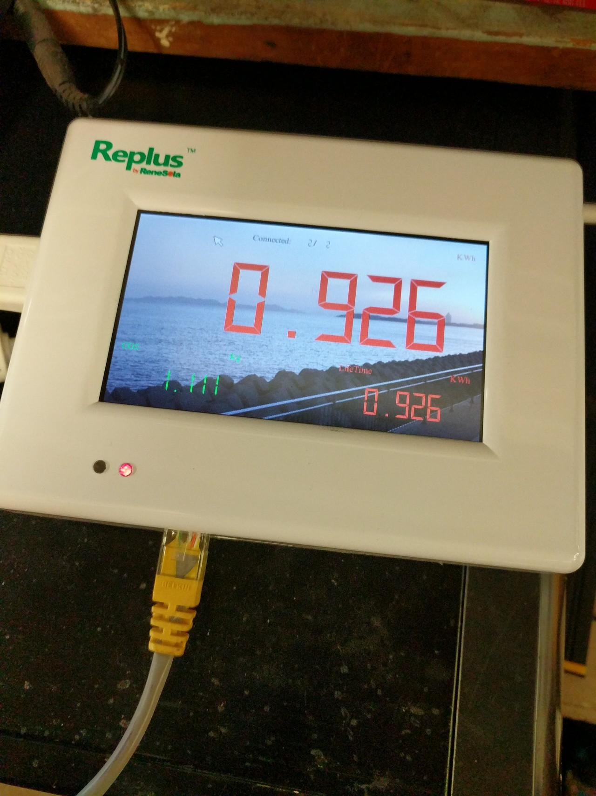

# ReneSola_MRG
Access the ReneSola MRG device to monitor ReneSola Micro Replus Inverters in detail, which is important. 
Note that the original manufacturer of this device and all this stuff is probavly NEP - Or Northern Electroic & Power

Updated 2025 December for new templating standards in this HA release



The company ReneSola is pretty much out of bussiness. See their NYSE:SOL listing if you need proof, but there's a lot of hardware out there, and a lot of new-in-box hardware available on the liquidation market. Utsilizing this hardware keeps it out of a landfill and puts more solar on the grid and keeps a lump of coal somewhere from being burned. This is important. 

The MRG device monitors the over-all system totals, but does nothing to address output and conditons of the individual solar inverters, so the reality is that nobody knows which inverters are broken, and some WILL blow up,  what panels are dirty, who's overheating, or any module level data whatsoever. This USED to be available when Renesola had their cloud interface up, but no more. Everybody's been hung out to dry. UNTIL NOW!!

The purpose of this document is to, as best as possible, document access methods for the device, which, are so far limited to local HTTP access via a lightHTTPd server running on port 80. THERE IS NO BEAUTIFUL WEB UI. NONE. It's plain text files in a folder structure, which by the way, you can't easily browse. The folder structure is the same as what's in this repository. See the root > Gateway > folder, where the Gateway folder is the wwwroot. 

So here comes the fun part. I wanted better performance monitoring, and some liquidator across town had a bundle of these monitoring boxes called the “ReneSola MRG Micro Replus Gateway ” that would talk to each inverter with “Power Line Communication” like the old X-10 devices, it basically superimposes data during the zero crossing (when the sine wave of your AC power is zero volts) and anything plugged in can talk during those very brief times. There are lots of different protocols for this, and Renesola does NOT use any of them. They use some rando chip called the Miartech MI200E, which appears to only be available on alibaba. Datasheets (in Chinese) can be found with a fair degree of hunting, but they’re probably of little use. 


So I got this stupid box, which is a Linux box with a touch screen, 220V power input, USB and ethernet ports,  that tries to connect to “The Cloud” which is some server in China that’s only referred to by it’s IP address, and it’s long gone. You can’t change it, and it’s pretty well locked down, despite the USB port and old versions of lightHTTPd running on it. I’ll post the results from a nmap session at some point. BUT, I don’t feel entirely comfortable with it on my network, but it’s not doing anything weird, plus I gave it a bad gateway address, so it’s probably going to have to work pretty hard to get on the internet.  

You’d figure that with an Ethernet port, you could log in to it and get some web page for looking at statistics, but no. You get 404 errors. It’s got an SSH port open, but I wasn’t able to figure out the credentials. So, useless, but after some digging, and then backing up the device to a thumb drive, I discovered that it made a big old tarball with a directoy structure that started with root. So there was that.  It started with root>Gateway>data>0>day.dat and a bunch of other files. And it just so happened to perfectly mirror the structure of the onboard web server. So putting in http://10.41.61.21/data/0/min.dat would download a file (on your own LAN of course) of minute-by-minute data that was literally every minute since midnight of that day. It looked like this, human readable and space delimited. And all day, it just appends more data to the end of the file, and overwrites every day at midnight. 
```

2019-07-07 12:49 0.258998 27.59 239.4 0.53 60.18 43 0.588 1 2500 0
2019-07-07 12:50 0.304852 27.7 239.9 0.96 60.17 43 0.593 1 2500 0
2019-07-07 12:51 0.299407 27.14 239 0.52 60.18 43 0.598 1 2500 0
2019-07-07 12:52 0.249534 27.43 238.5 0.49 60.19 43 0.602 1 2500 0
2019-07-07 12:53 0.230488 27.35 238.1 0.47 60.2 43 0.605 1 2500 0
2019-07-07 12:54 0.219258 27.19 238.5 0.46 60.2 43 0.608 1 2500 0
2019-07-07 12:55 0.213326 26.9 237.6 0.44 60.18 44 0.612 1 2500 0
2019-07-07 12:56 0.205836 27.26 237.2 0.44 60.2 44 0.616 1 2500 0

```

So there’s Date,Time, kW, MPPT/DC voltage, AC voltage, AC amps, AC frequency, temperature, total kWh, RSSI maybe, mystery and error code. 

The graphs look great in Google Sheets when you import this data, so it’s working.

I also managed to get it hooked up to Homeassistant as a REST sensor, with HTTP range requests, and a goofy template. So far this is probably the best way to work with it in an automatic kind of way. There's a folder for this. 

Now here’s the thing about Renesola. They’re GONE. That 20 year warranty? Gone with them. Check out their listing on the NYSE. So long. 


And what I’m writing here is literally the only data out there that you’ll ever see on these devices unless some brave ex-Renesola IT soul should come forward with better information and keep these things useful for a few more years. 

SO on to this HTTP directory structure. As follows: 


```
.
├── data
│   ├── 0
│   ├── 1
│   ├── 2
│   and so on and so on
│   ├── 254
│   └── 255
├── ddata
├── mdata
├── total
└── ydata
```

In the numeric folders in “data”, you have files called day_base.dat  day.dat  hour_base.dat  hour.dat  min.dat  min_tx.dat (with min.dat and min_tx appearing literally identical) Maybe other files are redundant too…

ddata, mdata and ydata have files called module0.dat thru module255.dat

and then in the total folder there’s two plain, extensionless files called
dayEnergy  and energy

dayEnergy is formatted like so:
```
1562475602 627.000000
1562475602 313.000000
1562475602 314.000000
```
which is linux time, first line is the system total, followed by each panel on each line. Energy is the same data, but without timestamps. 

As for these moduleX.dat files, I can’t really say. It’s linux time, followed by zeros, and terminating with some unprintable characters that I haven’t figured out. The backup I took was from the first day of operation, so maybe this isn’t fleshed out yet, and will probably look a lot different a few days in.  Oddly, I can’t seem to make another backup, so I’m lucky to have picked this one up.


Using my really unsighyly REST sensor and template, you can get real honest sensor readings in to Homeassistant. Even ask my mom! 

# Root access to the Renesola MRG!
A very special shoutout to the Postman for providing the root password to these things!
It's `nep` - Yet that's it, three characrters. 

Probably the next thing to do is to enable FTP access - 
edit /etc/initd.conf and remove the # from 
`#ftp	stream	tcp	nowait	root	/usr/sbin/ftpd		/usr/sbin/ftpd`
to enable FTP

Upon root access, I've discovered that the interface is written in QT (or at least the Trolltech.conf file leads me to believe this to be the case) 

uname -a yields `Linux Gateway 2.6.32.40-PlcGateway #84 PREEMPT Mon May 13 07:40:18 EDT 2013 armv4tl GNU/Linux`

cat /proc/version gives `Linux version 2.6.32.40-PlcGateway (root@localhost.localdomain) (gcc version 4.4.3 (ctng-1.6.1) ) #84 PREEMPT Mon May 13 07:40:18 EDT 2013`

Everythign is stored in flash memory, so no dev/sda but dev/mtd and set up as follows:
```[root@Gateway /proc]# cat mtd 
dev:    size   erasesize  name
mtd0: 00060000 00020000 "uboot"
mtd1: 00020000 00020000 "param"
mtd2: 00500000 00020000 "Kernel"
mtd3: 0fa80000 00020000 "root"
mtd4: 10000000 00020000 "nand"
```
I've imaged all of these partitions, and I'm trying to copy everything out before I really start digging. The last thing I want to do is break this thing. 

# MAJOR EUREKA MOMENT! ENABLE THE WEB INTERFACE!:
This is huge! So the Renesola MRG has a web interface, but somebody BROKE it before shipping it. Thanks for nothing guys! Bue here's how you fix it...

SSH in to the box: (Do this from Linux or some other SSH program, Putty, etc.)
user name `root`
password `nep`
It may give you some guff about a key, or a key not matching, just connect anyways. 
Your goal here, now, is to rename a file in the Gateway folder called `index.bak` to `index.html` and that's it. So issue this command...to make a copy of said file, because it's small and nobody really minds. 

`cp Gateway/index.bak Gateway/index.html`

Then type `exit` to disconnect and now just go to the IP address of your MRG in your browser and VOILA!! 


There's also a URL called (obviously replace 192.168.1.28 with your MRG's address)

http://10.44.63.28/misetup/ where you can set up all your inverter parameters, but PASSWORD IS UNKNOWN!

http://192.168.1.28/wifi/ where you can...set up a wifi card that doesn't exist, but maybe you can stick in the USB? Why?


# To Do:

Look in to a system to better auto-increment the individual naming of inverter modules and sensors. Because each MRG can support 255 panels, so that YAML file would be a BEAST. 
